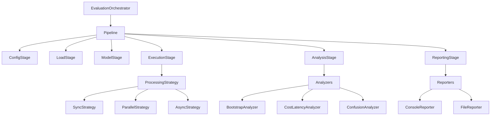

# Modular Evaluation Framework

Instructor Classify includes a modular evaluation framework that provides a flexible, extensible system for evaluating classification models.

## Architecture Overview

The modular evaluation system is built around several key components:



## Key Components

### 1. Pipeline Architecture

The evaluation system uses a pipeline architecture that executes stages in sequence:

1. **ConfigStage**: Loads and validates configuration
2. **LoadStage**: Loads classification definitions and evaluation sets
3. **ModelStage**: Initializes classifiers with appropriate clients
4. **ExecutionStage**: Runs evaluations using the selected processing strategy
5. **AnalysisStage**: Analyzes results with configured analyzers
6. **ReportingStage**: Generates reports and visualizations

### 2. Processing Strategies

The framework supports multiple processing strategies to optimize evaluation speed:

- **SyncProcessingStrategy**: Sequential processing for simplicity
- **ParallelProcessingStrategy**: Thread-based parallelism for CPU-bound tasks
- **AsyncProcessingStrategy**: AsyncIO-based parallelism for IO-bound tasks

### 3. Caching Layer

A disk-based caching system helps with resilience and performance:

- Cache LLM responses to avoid unnecessary API calls
- Resume interrupted evaluations from cached results
- Calculate hit rates and metrics for cache efficiency

### 4. Analyzers

Pluggable analyzers perform different types of analysis:

- **BootstrapAnalyzer**: Statistical confidence intervals using bootstrap resampling
- **CostLatencyAnalyzer**: Token usage, cost estimation, and latency metrics
- **ConfusionAnalyzer**: Confusion matrices and error pattern analysis

### 5. Reporters

Configurable reporting systems display and save results:

- **ConsoleReporter**: Rich terminal output with tables and formatting
- **FileReporter**: Saves results to JSON files for further analysis

## Running Evaluations

### Command Line Interface

You can run evaluations using the CLI with various options:

```bash
# Basic evaluation
instruct-classify eval --config configs/example.yaml

# Override parallelism mode
instruct-classify eval --config configs/example.yaml --mode parallel --jobs 8

# Disable caching
instruct-classify eval --config configs/example.yaml --no-cache
```

### Configuration

The evaluation configuration is defined in a YAML file with expanded options:

```yaml
# Models to evaluate
models:
  - "gpt-3.5-turbo"
  - "gpt-4o-mini"

# Paths to classification definition and eval sets
definition_path: "definitions/intent_classification.yaml"
eval_sets:
  - "datasets/evalset_multi.yaml"
  - "datasets/evalset_single.yaml"

# Processing configuration
parallel_mode: "parallel"  # Options: sync, parallel, async
n_jobs: 4                  # Number of workers

# Analysis parameters
bootstrap_samples: 1000
confidence_level: 0.95

# Caching configuration
use_cache: true
cache_dir: ".eval_cache"

# Analyzers to use (select or omit specific analyzers)
analyzers:
  - bootstrap
  - cost
  - confusion

# Reporters to use
reporters:
  - console
  - file

# Optional parameters
output_dir: "results"
```

## Programmatic Usage

You can use the modular evaluation system programmatically:

```python
from instructor_classify.eval_harness.orchestrator import EvaluationOrchestrator
from instructor_classify.eval_harness.config.evaluation_config import EvaluationConfig

# Option 1: Use a configuration file
orchestrator = EvaluationOrchestrator("configs/example.yaml")
success = orchestrator.execute()

if success:
    # Access results
    results = orchestrator.get_results()
    analysis = orchestrator.get_analysis_results()
    
    # Use results
    for model, model_results in results.items():
        for eval_set, result in model_results.items():
            print(f"{model} on {eval_set}: {result.accuracy:.2%}")

# Option 2: Create configuration programmatically
config = EvaluationConfig(
    models=["gpt-3.5-turbo"],
    definition_path="definitions/intent_classification.yaml",
    eval_sets=["datasets/evalset_single.yaml"],
    parallel_mode="async",
    n_jobs=8,
    use_cache=True
)

# Save config to file if needed
config.save_to_file("configs/generated_config.yaml")

# Create and run orchestrator
orchestrator = EvaluationOrchestrator(config.create_temp_file())
orchestrator.execute()
```

## Extending the Framework

### Custom Processing Strategies

You can create custom processing strategies by subclassing `ProcessingStrategy`:

```python
from instructor_classify.eval_harness.base import ProcessingStrategy

class CustomProcessingStrategy(ProcessingStrategy):
    def process_batch(self, classifier, examples, is_multi=False):
        # Custom implementation
        results = []
        
        # Process examples with custom logic
        for example in examples:
            # ... your custom processing logic ...
            results.append(result)
            
        return results
```

### Custom Analyzers

Create custom analyzers by subclassing `Analyzer`:

```python
from instructor_classify.eval_harness.base import Analyzer

class CustomAnalyzer(Analyzer):
    def analyze(self, eval_result):
        # Custom analysis logic
        analysis_results = {
            "custom_metric": calculate_custom_metric(eval_result)
        }
        return analysis_results
        
    def display_results(self, analysis_results):
        # Custom display logic
        self.console.print(f"Custom Metric: {analysis_results['custom_metric']}")
```

### Custom Pipeline Stages

Add or replace pipeline stages by creating custom `PipelineStage` subclasses:

```python
from instructor_classify.eval_harness.base import PipelineStage

class CustomStage(PipelineStage):
    def __init__(self):
        super().__init__(name="Custom Stage")
        
    def execute(self, context):
        # Custom stage logic
        # ...
        
        # Update and return context
        context["custom_data"] = custom_results
        return context

# Use the custom stage
from instructor_classify.eval_harness.base import Pipeline
from instructor_classify.eval_harness.pipeline import ConfigStage, LoadStage

pipeline = Pipeline()
pipeline.add_stage(ConfigStage(config_path))
pipeline.add_stage(LoadStage())
pipeline.add_stage(CustomStage())  # Add your custom stage
# ...
```

## Caching Benefits

The disk-based caching system provides several benefits:

1. **Resilience Against Failures**: If evaluation crashes or is interrupted, cached results are preserved
2. **Cost Reduction**: Avoid repeated API calls to language models
3. **Faster Iterations**: Quick reruns for configuration changes
4. **Cross-Run Persistence**: Cache persists between different evaluation runs

To control caching:

```bash
# Enable caching (default)
instruct-classify eval --config configs/example.yaml --cache

# Disable caching
instruct-classify eval --config configs/example.yaml --no-cache
```

Or in your configuration:

```yaml
# Enable caching
use_cache: true
cache_dir: ".custom_cache_location"

# Disable caching
use_cache: false
```

## Comparison with Legacy Evaluator

The modular system coexists with the legacy `UnifiedEvaluator` class, which is maintained for backward compatibility. Here's how they compare:

| Feature | Modular System | Legacy System |
|---------|---------------|--------------|
| Architecture | Pipeline-based | Monolithic class |
| Extensibility | High (via interfaces) | Limited |
| Caching | Built-in disk cache | None |
| Error Handling | Improved with retries | Basic |
| Parallelism | Same options (sync, parallel, async) | Same options |
| Analysis | Pluggable analyzers | Fixed analyzers |
| Reporting | Multiple reporter options | Console + file |

The legacy `UnifiedEvaluator` now forwards to the new modular system behind the scenes, but it's recommended to use `EvaluationOrchestrator` directly for new code.